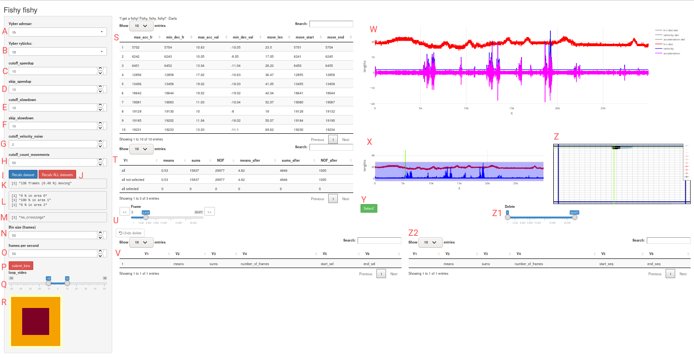

# User Manual for the "bevian" (Behavioral Video Analysis) pipeline

---

## The Data Analysis Pipeline consists of three main steps/tools

1. **Video processing**
   - The video is converted to per frame images covering selected area(s) with studied animal(s).

2. **Position inference**
   - Infering the position(s) of studied animal(s).

3. **Data analysis in R**
   - Starts the web-based (shiny) graphical user interface for the data analysis application.

# 1. Video processing
- The video processing, interactive selection of area(s) with studied animal(s), and conversion to per frame images is performed with our "VideoSplitter" program.
---
# 2. Position inference

- The positions of studied animals is obtained using the "ryby-infer" artificial inteligence program developed under collaboration by the team at the Technical University of Ostrava / IT4I. The open source code and the pretrained models are available from the https://github.com/spirali/ryby-infer repository.
---
# 3. Data analysis in R

- The web-based interactive graphical user interface for the data analysis application is programmed in R language. The R code as well as the required data files are available under the MIT license from the https://github.com/cernylab/bevian repository.

## Required Program/Data Files

1. **Python Script: `browse_inferred_tar.py`**
   - Opens short fish videos after certain actions in the application.

2. **R Script: `rybicky_shiny.R`**
   - Starts the primary data analysis application.

3. **Fish Mask Data:**
   - `ryby_maska.ods`: Excel-like file defining analysis regions.
   - `ryby_maska.csv`: Saved version of the `.ods` file used directly in the analysis.

---

## Automatically Generated Files

### Summary Graphs and Tables
Upon running the R script, several summary files and graphs are generated:
- **Graphical Outputs:**
  - `PERC_<directory>_all.png`: Movement graphs for all fish.
  - `VELO_<directory>_all.png`: Head-to-body distance and velocity graphs.
  - `VELO_HIST_<directory>_all.png`: Velocity histograms for all fish.

- **Tables:**
  - `table_<directory>.csv`: Aggregates average velocity, distance traveled, and acceleration peaks.
  - `<directory>_res.csv`: Detailed data for each fish's movement metrics.

---

## Data Processing

### Input Data Format
Input files such as `01_model_21Sep_inferred.csv` should have the following columns:
- `img_name`: Frame image names (e.g., `01_00001.jpg`).
- `head_x`, `head_y`: Coordinates for the head position.
- `tail_0_x`, `tail_0_y`: Coordinates for the tail position.

### Output Data Format
Processed files like `<directory>_res.csv` include:
- Movement metrics, percentages of time spent in specific regions, errors, and acceleration data.

### Error Detection
- Errors in fish position tracking are flagged using thresholds for lateral and forward movements.

---

## Cutoff Settings

### Velocity and Movement Cutoffs
1. **`cutoff_speedup`**: Threshold for identifying movement onset.
2. **`cutoff_slowdown`**: Defines deceleration windows for detecting movement ends.
3. **`cutoff_velocity_noise`**: Noise threshold for velocity data.
4. **`cutoff_count_movements`**: Determines the minimum frame count for detecting movements.

### Recalculation
- Use **"Recalc Dataset"** to update calculations for the current directory.
- Use **"Recalc ALL datasets"** for all directories.

---

## Graphical Interface

### Key Interactive Elements
1. **Graph Descriptions:**
   - Movement trajectories display x/y coordinates and time spent in each region.
   - Velocity and acceleration plots allow manual selection of ranges for further analysis.

2. **Tables:**
   - Interactive tables provide detailed summaries, enable selection, and refine data points.
   - Tables include movement summaries, regional overlaps, and frame-level corrections.

3. **Interactive Tools:**
   - Sliders adjust cutoff thresholds and bin sizes dynamically.
   - Select and refine specific regions or sequences directly in graphs or tables.

---

## Analysis Workflow

### Steps for Analysis
1. **Select a Directory:**
   - Use the dropdown to choose the directory for analysis.

2. **Refine Cutoffs:**
   - Adjust cutoffs for speed, noise, and acceleration thresholds as needed.

3. **Generate Outputs:**
   - View graphical summaries and tabular data for the selected directory or fish.

4. **Error Correction:**
   - Identify and correct positional errors in the data using flagged frames or manual adjustments.

5. **Export Data:**
   - Save refined outputs to CSV files for further downstream analysis.

---

## Outputs Overview

### Key Outputs
1. **Summary Tables:**
   - `RESULTS_conditions.csv`: Aggregates cutoff settings and analysis inclusion.
   - `RESULTS_table.csv`: Comprehensive metrics for movement and velocity.
   - `<directory>_res.csv`: Processed data for individual fish.

2. **Visual Summaries:**
   - Graphs for movement, velocity histograms, and trajectory plots.

3. **Specialized Files:**
   - Binned velocity data in `directory_fish_bins.csv`.
   - `general_cutoffs.csv`: Default cutoff settings.

---

## Notes on Error Handling

### Error Types
1. **Predicted Errors:**
   - Identified based on abnormal lateral movements or insufficient forward movements.

2. **Manual Selections:**
   - Highlighted sections in graphs or flagged rows in tables can be adjusted to improve data quality.

3. **Correction Outputs:**
   - Updates are saved in associated `.csv` or `.tsv` files for recordkeeping.

---
